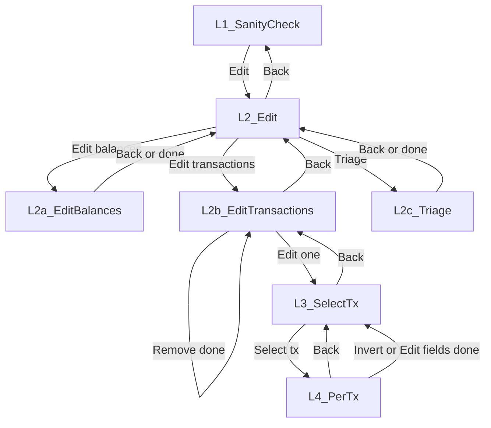

# Implementation Report: Fix SANITY Navigation UX

**Date:** 2026-02-13  
**Scope:** SANITY stage hierarchical Back semantics and post-action return points (v0 nested loops).  
**Version:** 0.1.4 (unchanged).

---

## 1. Executive Summary

The SANITY stage used a single top-level loop: every "← Back" and every post-action step returned to the SANITY Level 1 menu (Accept / Edit / Skip). That broke the operator’s mental model when correcting multiple transactions: Back was expected to mean one level up (e.g. back to the transaction list), not return to the top. The fix introduces nested loops (L2, L2b, L3) so that Back means one level up and post-mutation flows return to the correct screen (e.g. after Edit fields / Invert sign → transaction list L3; after triage confirm → Edit submenu L2). No changes were made to canonicalize/validate/FITID/emitter logic, persistence, or schema.

---

## 2. Previous Navigation Model (Before Fix)

A single `while True` in `_run_sanity_stage` drove the whole SANITY flow. Every `continue` in the Edit subtree (Edit submenu, Edit balances, Edit transactions, triage, per-transaction menu) sent control back to the top of that loop—i.e. to Level 1 (Sanity check: Accept / Edit / Skip / …). As a result:

- Back from the per-tx menu (L4), from the transaction list (L3), from Edit transactions (L2b), from triage (L2c), or from Edit balances (L2a) all returned to L1.
- After applying Invert sign, Edit fields, triage confirm, balance edit, or Remove some transactions, the next screen was always L1.

That caused P0/P1 UX issues: operators had to re-enter Edit → Edit transactions (and optionally triage context) repeatedly when fixing several transactions, with no way to “go back one level” to the list or to the Edit submenu.

---

## 3. New Navigation Model (After Fix)

- **Back** means one level up from the current screen (except “Back to list” in recovery, which still exits SANITY).
- **Screen levels:** L1 (Sanity check) → L2 (Edit) → L2a (Edit balances), L2b (Edit transactions), L2c (Triage) → L3 (Select transaction) → L4 (Per-tx: Edit fields / Invert sign).
- **Post-mutation return targets:** After Edit fields or Invert sign → L3 (transaction list). After triage confirm → L2. After Edit balances confirm → L2. After Remove some transactions → L2b.
- **Recovery:** “Back to list” at L1 still raises `RecoveryBackRequested`; hierarchy below L1 is unchanged.

---

## 4. Control Flow Changes

- **Approach:** Nested loops instead of a full state machine or screen stack, to keep the diff small and limit risk.
- **L1:** Unchanged; still the outer `while True` (Sanity check menu).
- **L2:** When `action == "edit"`, the entire Edit subtree is wrapped in a new `while True` (Edit submenu). “← Back” does `break` to L1; L2a/L2c one-shot blocks end with `continue` (stay in L2); entering Edit transactions enters the L2b loop.
- **L2b:** “Edit transactions” menu and Remove / Edit one are wrapped in `while True`. Back → `break` to L2. Remove → mutate, recompute, render, `continue` (stay in L2b). “Edit one” enters the L3 loop; after L3 exits, `continue` (re-show L2b).
- **L3:** Transaction selection (inquirer.select) is wrapped in `while True`. Back/cancel → `break` to L2b. On tx selected, L4 (per-tx menu) runs; Back from L4 or after Edit fields/Invert → `continue` (re-show L3).
- **Preserved:** Single auto-open of source PDF when entering Edit; Preview at L1; `dev_non_interactive` early return; recovery “Back to list” only at L1.

---

## 5. Test Adjustments

- **Updated existing tests** to match new return points and Back behaviour: `test_sanity_stage_edit_balances_back_returns_to_menu`, `test_sanity_stage_edit_tx_back_returns_to_menu`, `test_sanity_triage_valid_then_edit_shows_only_non_valid`, `test_sanity_triage_flagged_then_edit_shows_only_flagged`, `test_sanity_triage_flag_priority_over_valid`, `test_sanity_triage_all_valid_then_edit_shows_empty_message`, `test_sanity_invert_sign_negates_amount`, `test_sanity_invert_sign_swaps_debit_credit`, `test_sanity_triage_and_invert_sign_filter_unchanged`, `test_sanity_stage_auto_opens_pdf_on_edit_balances`. Sequences now include extra “back” steps where Back goes to L2 or L2b instead of L1, and (where applicable) inquirer.select returns for L3 after invert.
- **New navigation tests:** `test_sanity_back_from_l4_returns_to_l3`, `test_sanity_back_from_l3_returns_to_l2b`, `test_sanity_back_from_l2b_returns_to_l2`, `test_sanity_after_invert_returns_to_l3_not_l1`, `test_sanity_after_triage_confirm_returns_to_l2_not_l1`, `test_sanity_recovery_back_to_list_exits_sanity`. They assert Back targets and that post-action return is to L3 or L2 (not L1), and that recovery “Back to list” still raises `RecoveryBackRequested`.
- **Not covered:** Breadcrumbs, screen stack, batch-edit, or non-interactive recovery flows beyond the existing dev path.

---

## 6. Behavioral Guarantees (Post-Fix Contract)

- Back always means one level up (except recovery “Back to list”, which exits SANITY).
- Per-tx actions (Edit fields, Invert sign) return to the transaction list (L3).
- Triage (Validate/Flag) confirm returns to the Edit submenu (L2).
- Edit balances confirm returns to the Edit submenu (L2).
- Remove some transactions returns to the Edit transactions menu (L2b).
- No persistence, schema, or pipeline (canonicalize/validate/FITID/emitter) changes.

---

## 7. Known Limitations

- No breadcrumbs or context headers.
- No screen stack abstraction; navigation is encoded in loop structure.
- Nested loops may become harder to extend for new menus or flows.
- Sanity panel still re-renders after every mutation.
- No batch-edit mode (e.g. “edit next transaction” without re-selecting).

---

## 8. Future Version Improvements (Post v0.1.x)

- Replace nested loops with an explicit state machine or screen stack for easier extension and testing.
- Add breadcrumbs or a short context header (e.g. “Edit › Transactions”) on submenu prompts.
- Option to “edit next transaction” automatically after applying Edit fields/Invert (e.g. by index order) to reduce repeated selection.
- Optional “quiet” render mode (e.g. skip panel re-render for a sequence of mutations) to reduce noise.
- Batch-edit mode: apply one action (e.g. Invert sign) to multiple selected transactions from L3.
- Consider a thin UI/UX abstraction (e.g. screen descriptors + router) to separate navigation from business logic.

---

## 9. Diff Scope Summary

- **Modified:** `src/pdf2ofx/cli.py` (`_run_sanity_stage`: L2, L2b, L3 loops and return/break/continue targets), `tests/test_cli.py` (updated sequences and six new navigation tests).
- **Added:** `docs/implementation_reports/2026-02-13/IMPLEMENTATION_REPORT_fix_SANITY_navigation_UX.md`.
- **Unchanged by design:** `compute_sanity`, `render_sanity_panel`, canonicalize/validate/FITID/emitter, persistence, schema, `pyproject.toml` (version remains 0.1.4).
